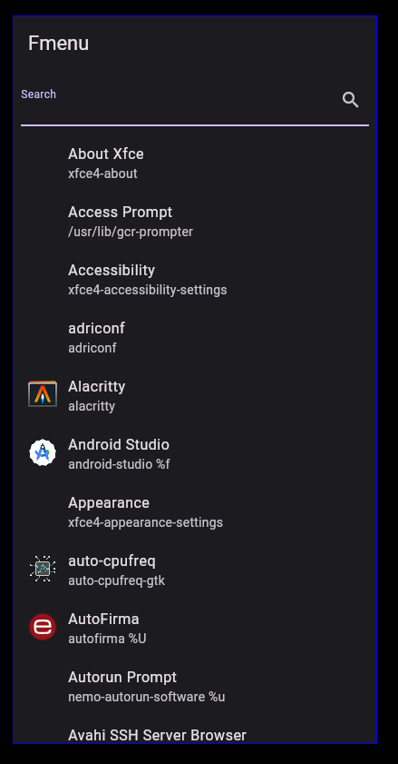

# fmenu
Rofi-like menu

# Preview


# Build
```bash
flutter build linux --release
sudo ln -s $(pwd)/build/linux/x64/release/bundle/fmenu /usr/local/bin/fmenu
```

# Integration with qtile
```python
keys = [
    # other keys
    Key([mod], "d", lazy.spawn("fmenu"), desc="launch fmenu"),
]
```
